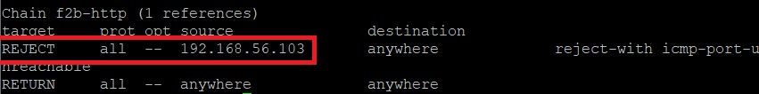

# Fail2ban防範暴力破解Wordpress
## 使用環境
* 伺服器端為centos 7(wordpress需要Apache,PHP,MariaDB)
    >　Wordpress架設參考[Install WordPress 5 with Apache, MariaDB 10 and PHP 7 on CentOS 7](https://www.tecmint.com/install-wordpress-with-apache-on-centos-rhel-fedora/)。
* 駭客端為kali linux
     
駭客端暴力破解工具為hydra
伺服器端防護工具為fail2ban(需安裝python)。    
## Hydra攻擊指令介紹      
      
先查看網頁的原始碼，在擷取需要的資料，詳細說明參考[Hydra操作說明](https://github.com/NQUwebsecurityproject/website-security/tree/master/Hydra%E6%93%8D%E4%BD%9C%E8%AA%AA%E6%98%8E)，攻擊指令如下：       
```
hydra -l smallan -P pwdtxt -V 192.168.56.2 http-form-post "/wp-login.php:log=^USER^&pwd=^PASS^&wp-submit=Log In&testcookie=1:ERROR"
```
## Fail2ban
### 設定檔編寫  
```
vi /etc/fail2ban/jail.conf
```
添加以下內容
```python
[wordpress]
enabled = true
filter = wordpress
action = iptables-multiport[name=http, port="http,https",protocol=tcp]
         sendmail-whois[name=wordpress, dest=root@localhost,sender=fail2ban]
logpath  = /var/log/httpd/tecminttest-acces-log
maxretry = 120  # 登入失敗120次封鎖
findtime = 120
bandtime = 120
```
> 這裡設定兩分鐘之內有120次以上嘗試登入的動作，該ip就會被禁止連線2分鐘的時間。
### 過濾器編寫
過濾器的作用是在log檔中比對出駭客攻擊的訊息。     
先查看log檔：
```
cat /var/log/httpd/tecminttest-acces-log
```
> 此處wordpress的log檔在tecminttest-acces-log


編寫過濾檔     
```
vi /etc/fail2ban/filter.d/wordpress.conf
```
```python
# Fail2Ban wordpress filter

[Definition]

failregex =<HOST> - - .*"POST /wp-login.php
ignoreregex =
```
> 伺服器一次連線會有GET與POST的紀錄，所以這裡只抓POST的紀錄

### 過濾器測試
測試過濾檔有沒有比對到log檔的內容：      
```
fail2ban-regex /var/log/httpd/tecminttest-acces-log /etc/fail2ban/filter.d/httpd
```      
      
重啟fail2ban：      
```
systemctl restart fail2ban
```
再做一次駭客端攻擊測試          
發現沒有成功，而且還被伺服器禁止做連線。

### 查看設定檔的執行狀態
```
fail2ban-client status wordpress
```     
       

> 此處可以看到駭客的ip 192.168.56.103被ban掉了，代表防護成功!!!

再來觀察iptables的狀況       

```
iptables --list
```       
        
確實iptables有把駭客的ip給reject掉了! 駭客端想要連此ip的話就會連不上，只能等bantime時間結束為止      
