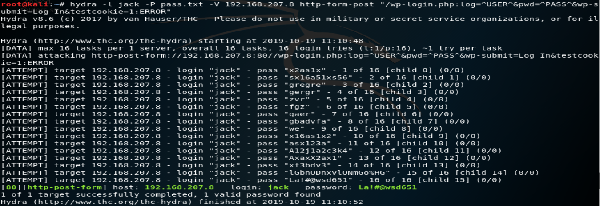
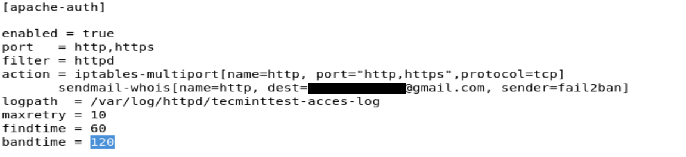
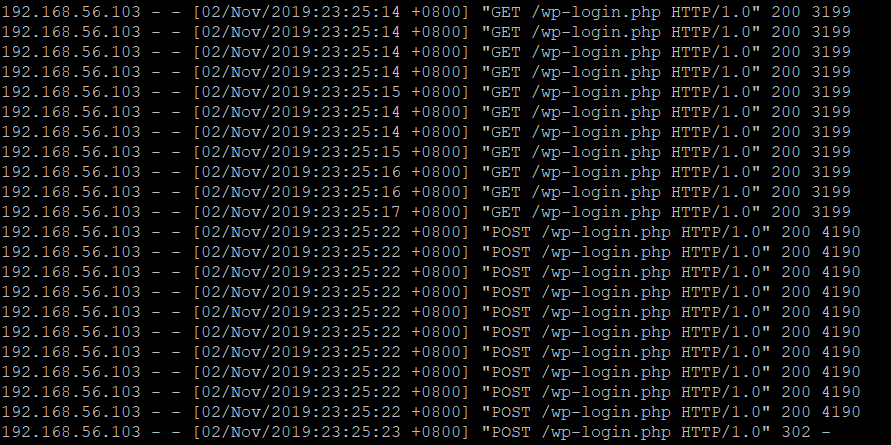
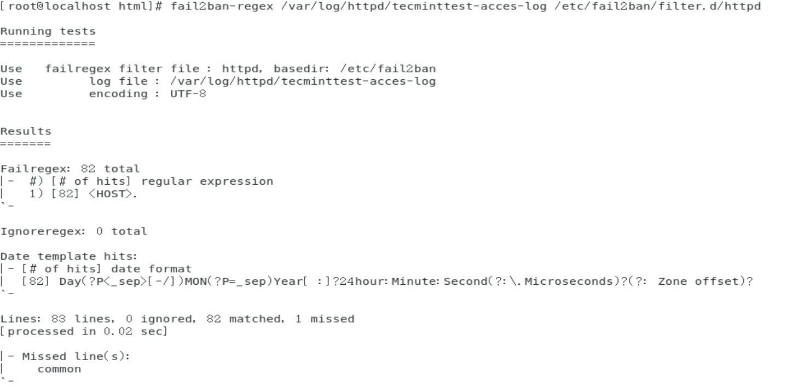
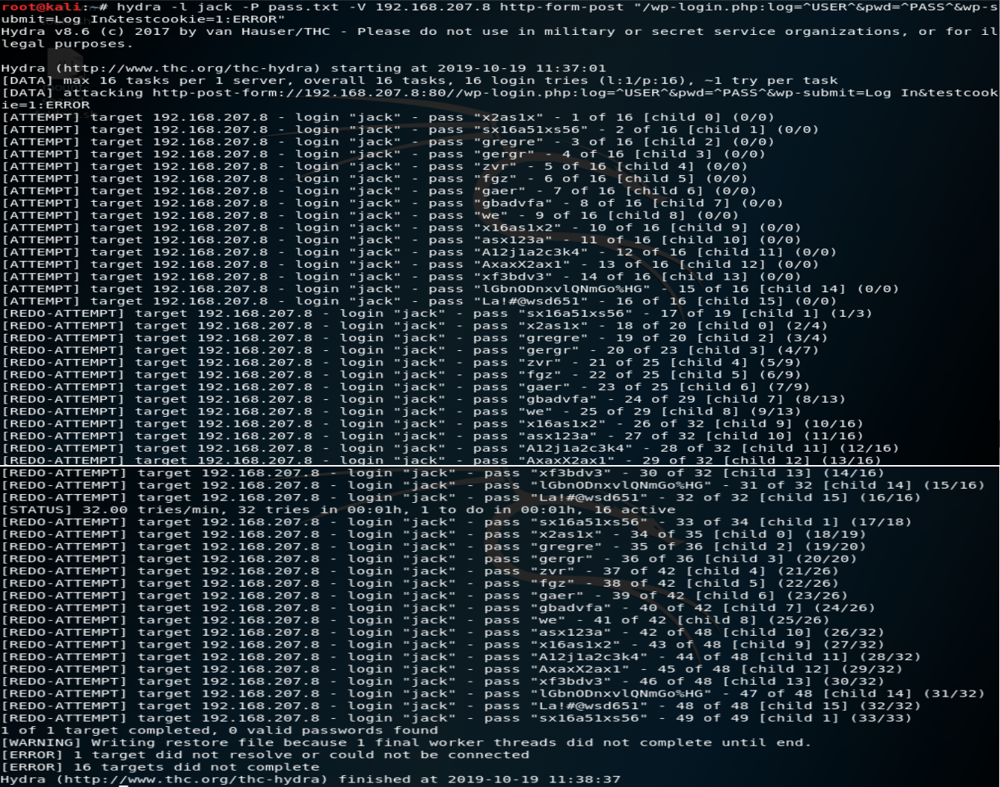

# Fail2ban防範暴力破解Wordpress
## 使用環境
伺服器端為centos 7(wordpress需要Apache,PHP,MariaDB)，駭客端為kali linux，伺服器端Wordpress架設可參考[Install WordPress 5 with Apache, MariaDB 10 and PHP 7 on CentOS 7](https://www.tecmint.com/install-wordpress-with-apache-on-centos-rhel-fedora/)。     
駭客端暴力破解工具為hydra，伺服器端防護工具為fail2ban(需要python)。    
## 攻擊指令介紹      
      
先查看網頁的原始碼，在擷取需要的資料，詳細說明參考[Hydra操作說明](https://github.com/NQUwebsecurityproject/website-security/tree/master/Hydra%E6%93%8D%E4%BD%9C%E8%AA%AA%E6%98%8E)，攻擊指令如下：       
```
hydra -l jack -P pass.txt -V 192.168.207.8 http-form-post "/wp-login.php:log=^USER^&pwd=^PASS^&wp-submit=Log In&testcookie=1:ERROR"
```
## Fail2ban規則編寫
### 規則檔編寫
從acces-log檔中發現駭客攻擊的話，就把駭客的ip禁止做連線，可以設定要禁止多久。     
 > ban IP的功能主要是結合iptables。     
/etc/fail2ban/jail.conf 添加以下內容：      
```
[apache-auth]   ##名稱
enabled = true  ##啟用
port   =http,https
filter = httpd    ##過濾檔名稱
action = iptables-multiport[name=http, port="http,https",protocol=tcp]               ##動作
       sendmail-whois[name=http, dest=...@gmail.com, sender=fail2ban]      #能寄送email
logpath  = /var/log/httpd/tecminttest-acces-log      #acces-log檔位置
maxretry = 10                       #登入失敗幾次封鎖 
findtime = 60                        
bandtime = 120                      #被ban的時間
```       
      
### 過濾器編寫      
過濾器的作用是在acces-log檔中比對出駭客攻擊的訊息。     
先查看acces-log檔：
```
cat /var/log/httpd/tecminttest-acces-log
```     
       
再編寫過濾檔：       
```
gedit /etc/fail2ban/filter.d/httpd.conf
```
         
```
# Fail2Ban httpd filter
#
[INCLUDES]
# Read common prefixes. If any customizations available -- read them from
# apache-common.local
before = apache-common.conf

[Definition]

failregex =<HOST>.
ignoreregex =
```
 > 主要是failregex的內容：        
 > failregex =\<HOST>.      
 > 這行就是比對acces-log檔，有哪些資料最開頭是相同的IP。       
 > 此fail2ban是用python寫的，所以過濾器的正規表達式也是用python的。    
### 過濾器測試與實際防護測試
測試過濾檔有沒有比對到log的內容：      
```
fail2ban-regex /var/log/httpd/tecminttest-acces-log /etc/fail2ban/filter.d/httpd
```      
       
制定好確認沒問題後，重啟fail2ban：      
```
systemctl start fail2ban
```
再做一次駭客端攻擊。     
       
發現沒有成功，而且還被伺服器禁止做連線。     
```
fail2ban-client status apache-auth
```     
         
再來觀察iptables的狀況    
```
iptables -list
```
確實iptables有把駭客的ip給ban掉了! 駭客端想要連此ip的話就會連不上，只能等bantime時間結束為止      
資料來源: http://www.vixual.net/blog/archives/252