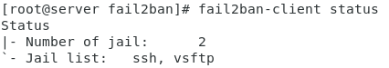
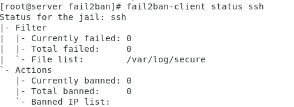
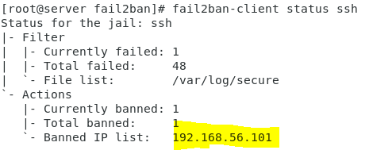
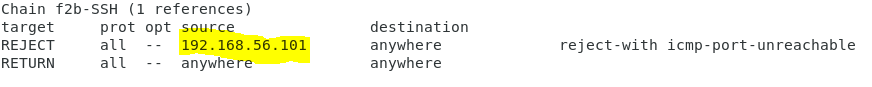

# 使用Fail2Ban防範暴力破解(ssh、vsftp) 

<font  size=2 >本教學者使用fail2ban安裝0.9.7版
</font>

Fail2ban 可以藉由掃描 log檔 (例如:/var/log/secure) 找出有惡意的IP進而去禁止其IP一段時間無法連入該伺服器或是永遠禁止，而暴力破解會造成一連串的登入失敗Fail2ban即可偵查出並加以防範。
## 1.安裝Fail2Ban
```
# yum install fail2ban
# systemctl enable fail2ban
# systemctl start fail2ban
```
## 2.更改設定檔
```
#cd /etc/fail2ban
#cp jail.conf jail.local
#vi jail.local
```

添加以下內容

```python
# 防護ssh #

[ssh]  
enabled  = true
filter    = sshd
action   = iptables[name=SSH, port=ssh, protocol=tcp]
            sendmail-whois[name=VSFTPD, dest=your_email, sender=fail2ban]
logpath  = /var/log/secure
findtime  = 180
maxretry = 30
bantime = 600
```
```python
# 防護vsftp #

[vsftp]
enabled  = true
filter   = vsftpd
action   = iptables[name=VSFTPD, port=ftp, protocol=tcp]
            sendmail-whois[name=VSFTPD, dest=your_email, sender=fail2ban]
logpath  = /var/log/secure 
findtime =180
maxretry = 30
bantime  = 600
```
> <font color="red">your_email</font>可改為你的email地址 

最後記得做
```
systemctl restart fail2ban
```
## 查看設定檔執行狀態
```
fail2ban-client status 
```

```
fail2ban-client status ssh
```


當駭客用暴力破解攻擊時


> 192.168.56.101 為駭客IP

查看iptables
```
iptables --list
```


