# Hydra 暴力破解 Wordpress

## 前言:
以下講解暴力破解主要是要測試防護功能所使用的，並非要特意教導大家去破解他人帳號密碼，請勿在公開網站使用暴力破解。

以下會講解如何編寫hydra指令
會先講解用
1. 網頁的開發人員工具查看網頁訊息
2. burp suite來擷取封包

以上方法使用一個就可以了，主要了解其網頁訊息就可以了

## 建立好wordpress

首先，建立wordpress，server IP 為192.168.56.2，
作者帳號為smallan

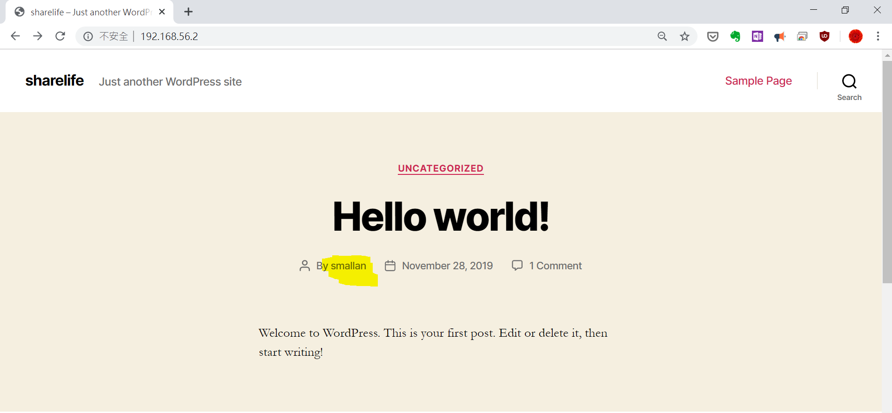

嘗試用smallan登入，查看錯誤訊息

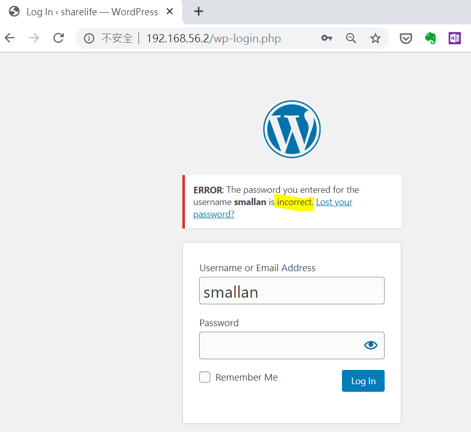

## 1.使用開發人員工具來查看網頁訊息

按下F12，查看網路狀態

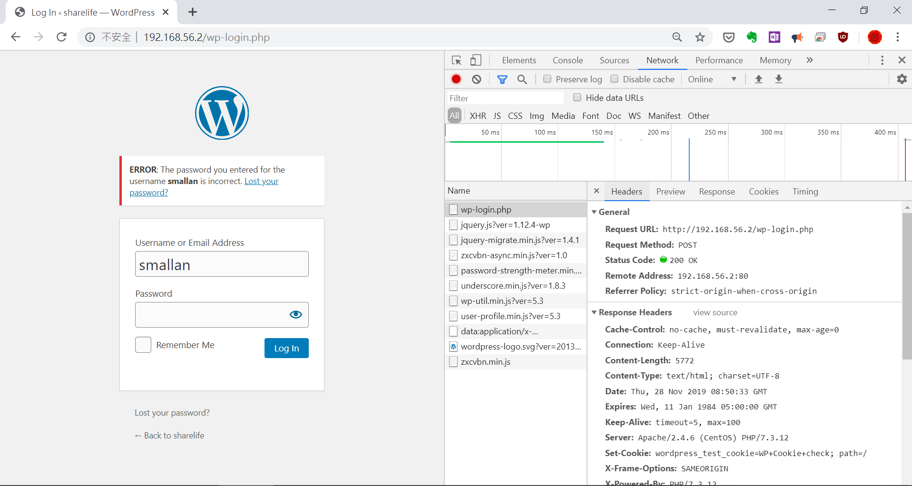

可以看到回傳訊息方式為POST

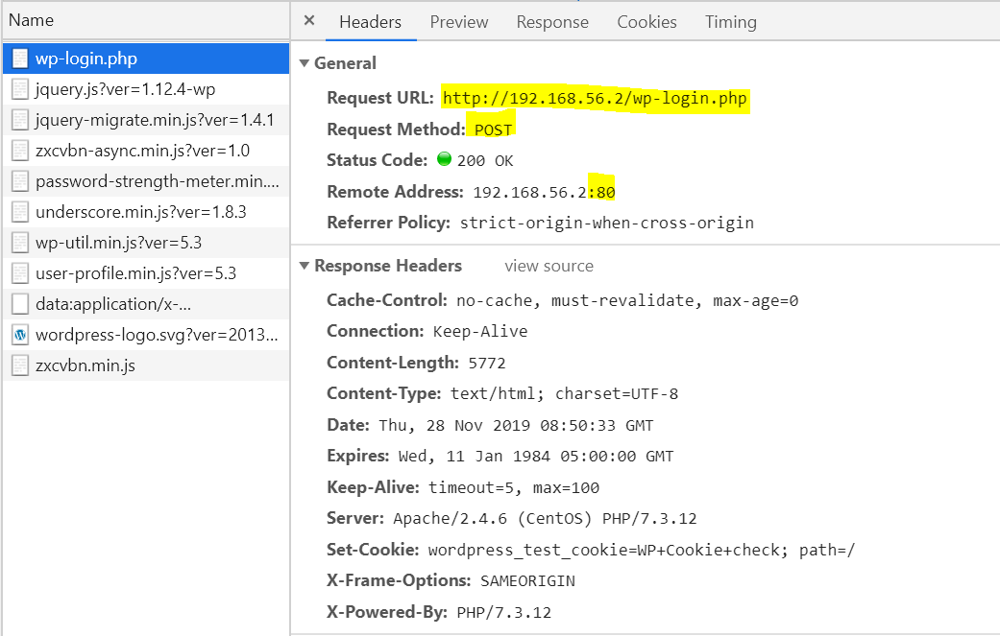

往下拉查看Form Data，可以看到帳號的名稱為log，密碼為pwd，等等..

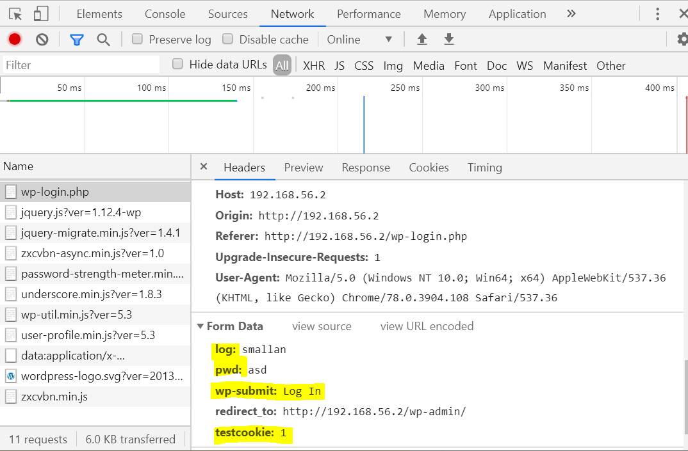

有以上這些訊息就可以嘗試暴力破解
```
hydra -l smallan -P pwdtxt -V 192.168.56.2 http-post-form "/wp-login.php:log=^USER^&pwd=^PASS^&wp-submt=Log In&testcookie=1:incorrect"
```
```
-l 後輸入要測試的帳號
-P 後輸入要測試的密碼檔
-V 測試的結果詳細列出
192.168.56.2 <server IP>或可以輸入網頁名稱
http-post-form 表單傳輸形式為POST
/wp-login.php 網頁名稱
log=^USER^    帳號
pwd=^PASS^   密碼
wp-submt=Log In&testcookie=1  後綴訊息
incorrect   登入錯誤訊息
```

## 2.使用burp suite來擷取封包

直接使用kalilinux已裝好burp suite來使用
網頁使用firefox

先要設定Proxy，所以網頁先設定
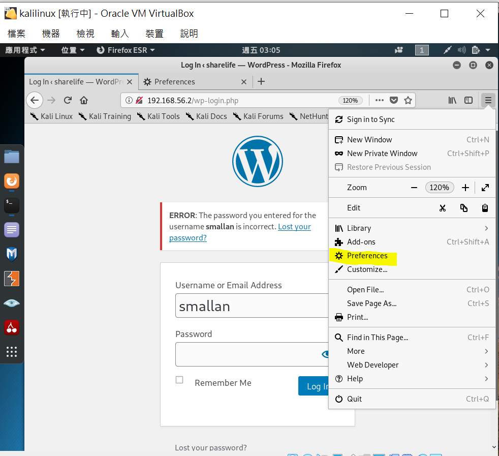

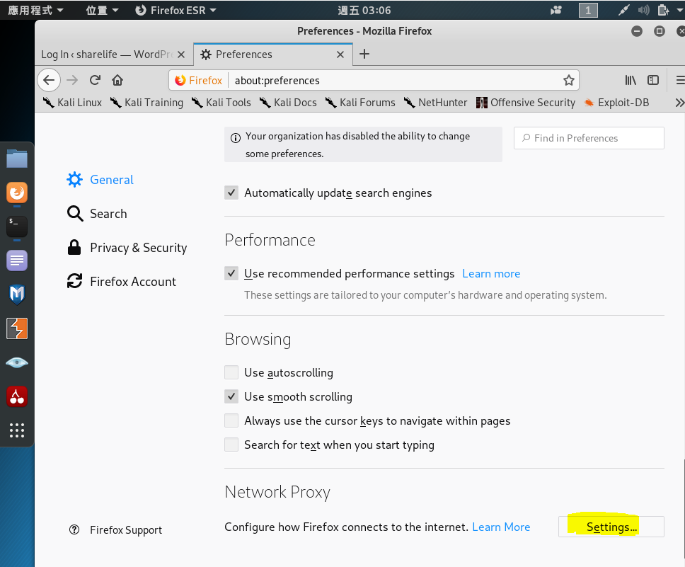

勾選Manual proxy configuration

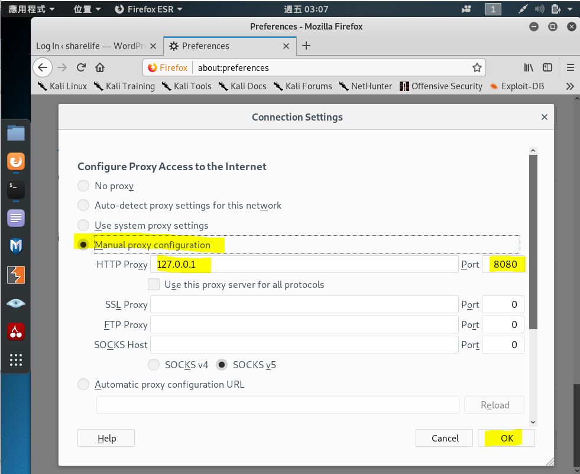

開啟burp suite，進入此畫面

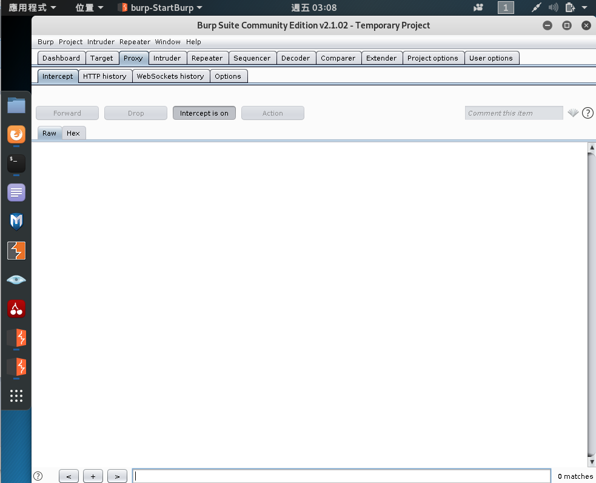

然後在wordpress測試帳號密碼送出

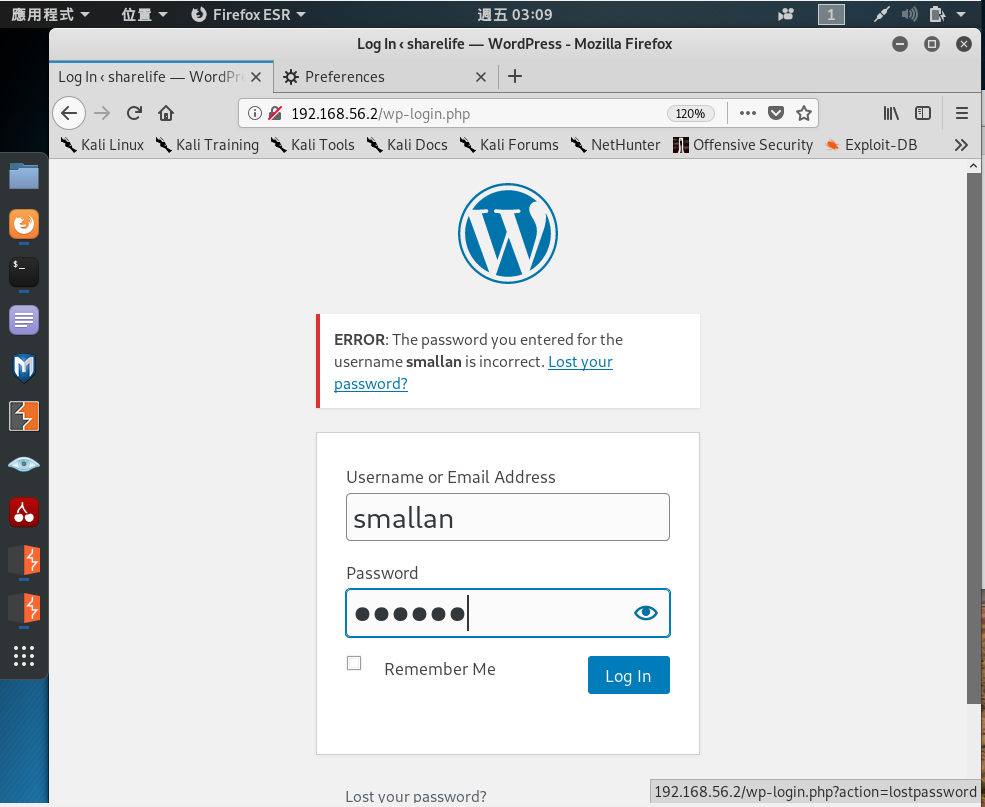

在burp suite就能擷取到wordpress封包訊息

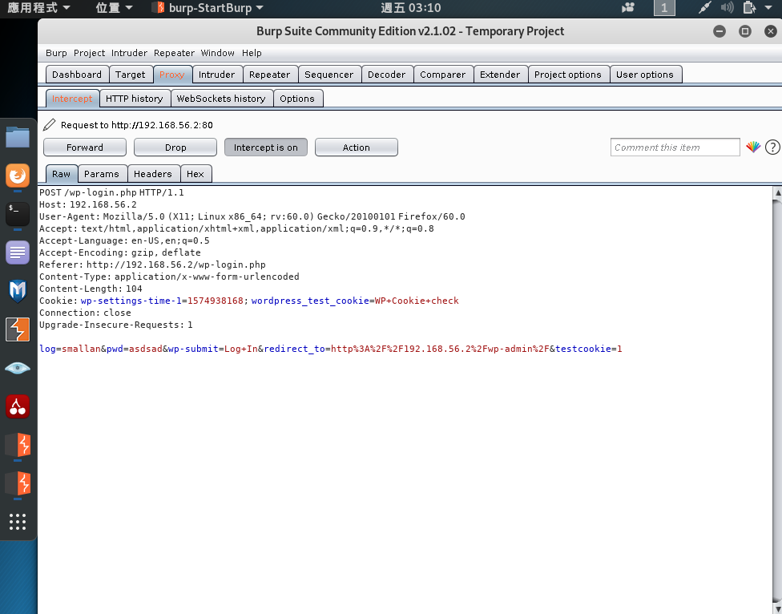

以下封包訊息與開發人員工具看到的差不多

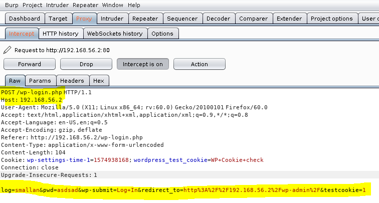