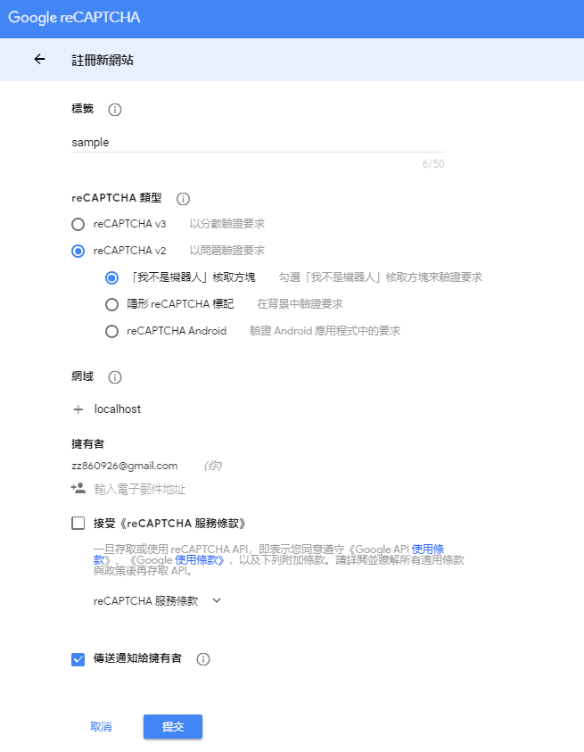
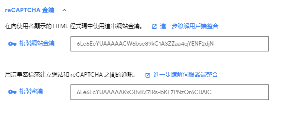
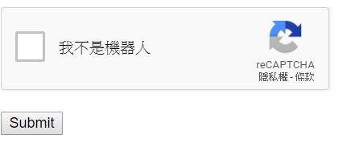
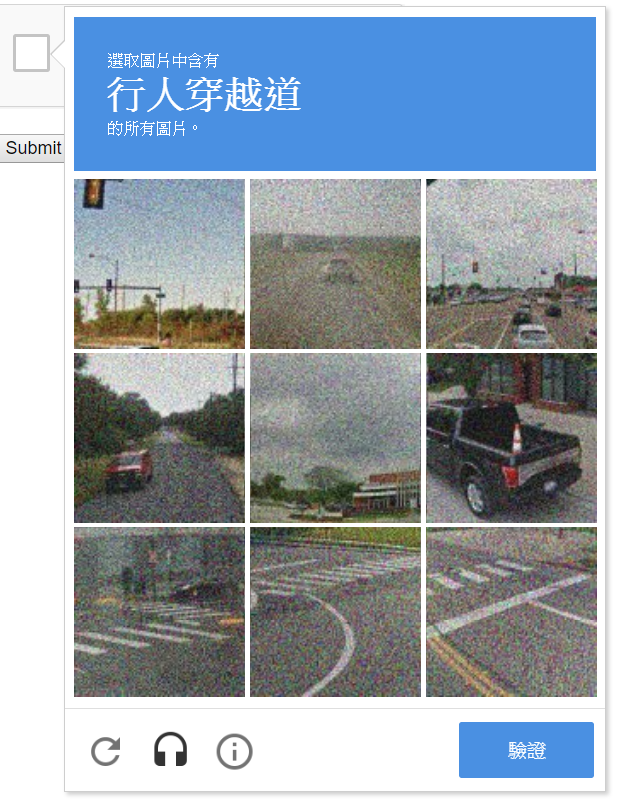

# Recaptcha網頁認證教學

## 第一步：註冊
先到[recaptcha官網](https://www.google.com/recaptcha/admin)註冊一個recaptcha管理帳號，並把想要認證的測試網頁網址加入recaptcha網頁認證管理。



然後就會產生金鑰


## 第二步 建置網頁
官方範例網頁
https://developers.google.com/recaptcha/docs/display

```html
<html>
  <head>
    <title>reCAPTCHA demo: Simple page</title>
    <script src="https://www.google.com/recaptcha/api.js" async defer></script>
  </head>
  <body>
    <form action="?" method="POST">
      <div class="g-recaptcha" data-sitekey="your_site_key"></div>
      <br/>
      <input type="submit" value="Submit">
    </form>
  </body>
</html>
```
把網站金鑰貼在data-sitekey後
```html
<div class="g-recaptcha" data-sitekey="your_site_key"></div>
```
測試網頁就會看到





## 第三步 設計登入網頁
（因每個人需求不同這邊僅供參考）

在recaptcha checkbox 認證行加入data-callback、data-expired-callback，你可以自行取一個好記的function名稱。
```html
<div class="g-recaptcha" data-sitekey="your_site_key" data-callback="verify" data-expired-callback="expired"></div>
```
[更多詳細內容](https://developers.google.com/recaptcha/docs/display#g-recaptcha_tag_attributes_and_grecaptcharender_parameters)

參數|說明
--- | ---
data-sitekey | 放網頁金鑰
data-theme | 定義recaptcha的風格，有dark和light兩種。
data-size |定義recaptcha的大小，有compact和normal兩種。
data-callback | 放認證成功後回傳的function。
data-expired-callback | 放認證過期後回傳的function。
data-error-callback |　放認證錯誤發生時回傳的function。

並在\<script>裡加上自定義的function：

```javascript
var Vstate = false;
function verify() {
  Vstate = true;
}
function expired() {
  Vstate = false;
}
```
最後在submit按鈕中加入一個onclick function，如果已經有了，直接在送submit的程式前加一個簡單的認證：
```html
onclick="javascript:return CheckValidate()" 
```
並在\<script>裡加上自定義的檢查function：
```js
function CheckValidate() {
  return Vstate;
}
```
這樣初步的網頁認證就完成了

## 第四步 完整程式碼
```html
<html>
    <head><meta charset="utf-8">
        <title>是個需要登入的網站</title>
        <script src="https://ajax.googleapis.com/ajax/libs/jquery/3.1.1/jquery.min.js"></script>
        <script src="https://www.google.com/recaptcha/api.js" async defer></script>
        <script>
                  var Vstate = false;
                function verify() {
                    $('#recaptchaV').text('');
                Vstate = true;
                }
                function expired() {
                Vstate = false;
                }
                  function CheckValidate() {
                    if (!Vstate) {
                      $('#recaptchaV').text('請勾選核取方塊');
                return Vstate;
                    } else {
                      $('#recaptchaV').text('');
            $('#demo-form').submit();
                    }
                }
        </script>
    </head>
    <body>
            <form id="demo-form"  action="login.php" method="POST">
            <span>賬號：</span><input id="acc" name="account" placeholder="賬號">
            <span>密碼：</span><input id="pwd" name="passwd" type="password" placeholder="密碼">
            <div class="g-recaptcha" data-sitekey="6LejqMYUAAAAABavniWIbmnLpjPMq5s0s8nVrxE9" data-callback="verify" data-expired-callback="expired"></div>
      <br/>
      <span id="recaptchaV"></span>
      <input  type="button"  onclick="javascript:return CheckValidate()" value="Submit">
    </form>
</body>
</html>

```

