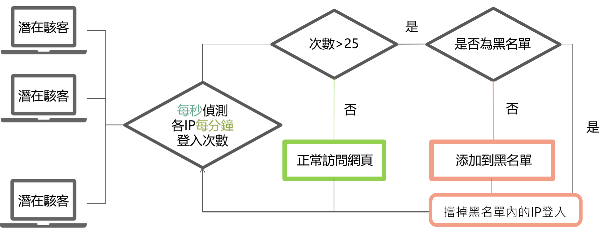
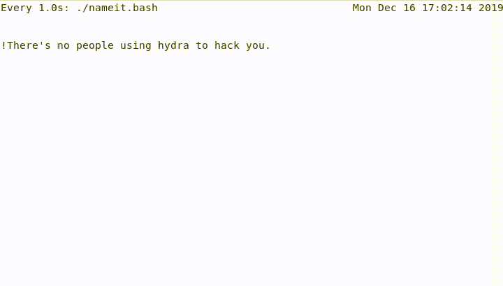
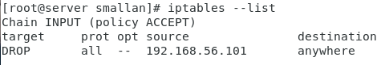
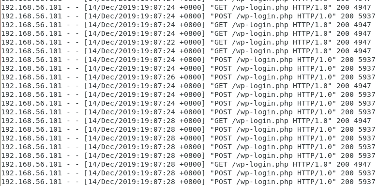

# bash檔編寫防範暴力破解

## 使用環境
* 伺服器端為centos 7(wordpress需要Apache,PHP,MariaDB)
    >　Wordpress架設參考[Install WordPress 5 with Apache, MariaDB 10 and PHP 7 on CentOS 7](https://www.tecmint.com/install-wordpress-with-apache-on-centos-rhel-fedora/)。
* 駭客端為kali linux
(簡易說明可前往[暴力破解Wordpress](https://github.com/NQUwebsecurityproject/website-security/tree/master/Hydra%E6%9A%B4%E5%8A%9B%E7%A0%B4%E8%A7%A3/%E6%9A%B4%E5%8A%9B%E7%A0%B4%E8%A7%A3Wordpress))
## bash檔流程圖


對log檔進行監控，只要有失敗登入達25次以上，就把對方的ip加到iptables的黑名單裡面，只要在黑名單裡面就會把對方傳來的封包丟掉

執行程式
```
watch -n 1 ./nameit.bash
```
>每秒執行一次 [nameit.bash](https://github.com/NQUwebsecurityproject/website-security/blob/master/bash%E6%AA%94%E7%B7%A8%E5%AF%AB%E9%98%B2%E7%AF%84%E6%9A%B4%E5%8A%9B%E7%A0%B4%E8%A7%A3/nameit.bash)

當有駭客攻擊時



查看iptables
```
iptables --list
```

> 駭客的ip傳來的封包都會被drop掉

## 如何設計bash檔
### log檔位置
先檢查自己的網頁的log檔是存放在哪裡
```
cat /var/log/httpd/tecminttest-acces-log
```


### 編寫bash檔
```
vim nameit.bash
```
開頭記得先打
```bash
# !/bin/bash
```

如流程圖，我們要每秒查看每分鐘各個IP有多少個訪問次數，所以首先要先把每分鐘的訪問記錄從log檔中取出來，並暫存在log.txt檔裡，取的方式很簡單，直接用grep匹配當前分鐘數就可以了。（注意：如果你的log檔和本地端有時差可以利用date本身的功能去調時差問題）

```bash
cat /var/log/httpd/tecminttest-acces-log | grep "$(env LANG=en_US date '+%d/%b/%Y:%H:%M')" > log.txt
```

### 過濾可疑IP
取出每分鐘訪問數之後，接下來是利用grep取出可疑的使用者ip
```bash
ip=$(cat log.txt | grep POST | grep wp-login.php | awk {'print $1'} | sort | uniq)
```
grep POST是因爲使用者在訪問登入頁面時就已經是用get去請求登入頁面資料，所以利用過濾POST才是在算真正送登入資料的次數。   
wp-login.php是登入頁面名稱，主要防範暴力破解所以只針對登入頁面進行防護。    
記得log檔訪問記錄可能會有一個ip有兩次以上訪問記錄，爲了區分各個ip，這邊先用sort和uniq去取出目前有哪些ip訪問。

### 細部操作
首先-z "\$ip"是若$ip爲空，則代表沒有人進行登入動作;   
不爲空則利用awk {'print NF'}釐清現在是只有單個ip爲潛在駭客還是多個
若爲多個IP    
則for 1到\$count，取出各個IP，再利用取出來的\$ip1，到暫存去取該ip的訪問次數，次數超過25次後檢查iptables是否有擋掉該ip（-C部分），若無則用iptables擋掉ip（-A部分）。
```bash
if [ -z "$ip" ]; then
    echo -e "\n!There's no people using hydra to hack you."
else
    count=$(echo $ip | awk {'print NF'})
    echo -e "\n! YOU BEEN HACKED:\n  potential hacker(s): $count"
    if [ $count -gt 1 ]; then
        for i in $(seq 1 $count);
        do
            ip1=$(echo $ip | awk "{print \$$i}")
            time=$(cat log.txt | grep POST | grep wp-login.php | grep -c $ip1\ )
            echo -e "  - hacker IP: $ip1\n    brute forse time: $time"
            if [ $time -gt 25 -a ! -z "$ip1" ]; then
                iptables -C INPUT -s $ip1 -j DROP
                if ! [ $(echo $?) -eq 0 ]; then
                    iptables -A INPUT -s $ip1 -j DROP
                    echo -e "\nBLOCK $ip1\n"
                else
                    echo -e "\nALREADY BLOCKED $ip1\n"
                fi
            fi
        done
        echo -e "END"
    else
        ip=$(echo $ip)
        time=$(cat log.txt | grep POST | grep wp-login.php | grep -c $ip)
        echo -e "\n  - hacker IP: $ip\n    brute forse time: $time\nEND"
        if [ $time -gt 25 ]; then
            iptables -C INPUT -s $ip -j DROP
            if ! [ $(echo $?) -eq 0 ]; then
                iptables -A INPUT -s $ip -j DROP
                echo -e "\nBLOCK $ip\n"
            else
                echo -e "\nALREADY BLOCKED $ip\n"
            fi
        fi
    fi
fi

```
