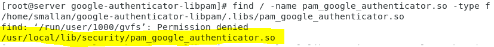
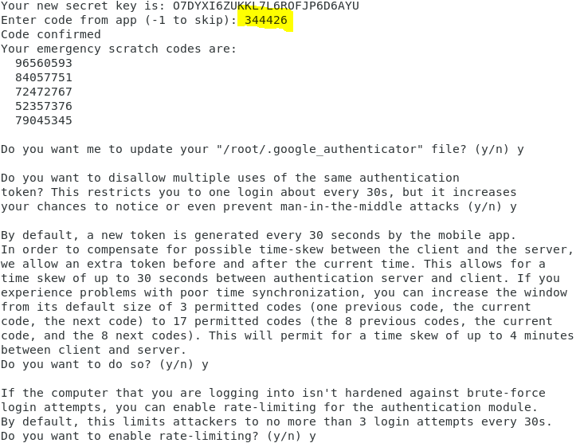

# CentOS 7 SSH 連線驗證(Google Authenticator)  
> 參照:[CentOS 7 SSH 兩步驟驗證](https://kenwu0310.wordpress.com/2016/12/09/centos-7-ssh-%E9%9B%99%E5%9B%A0%E7%B4%A0%E8%AA%8D%E8%AD%89-using-google-authenticator/)
## 安裝google-authenticator
因為要用到git的套件，所以要先看看你虛擬機上的git版本是否最新，如果不是請在root模式下:
```
# yum update nss curl\
```
>參考於:[git clone 報錯 incompatible or unsupported protocol version處理方法](https://blog.csdn.net/feinifi/article/details/79629904)。
先git clone google-authenticator-libpam到你虛擬機的桌面安裝Development Tools。

從github下載安裝google-authenticator
```
# git clone https://github.com/google/google-authenticator-libpam.git
```
先安裝編譯所需套件
```
# yum groupinstall "Development Tools" 
```
進行編譯
```
# cd google-authenticator-libpam
# ./bootstrap.sh
# ./configure
# make && make install
```
>                  
如果出現錯誤訊息，無法找到PAM library or the PAM header檔案，就先安裝pam-devel套件後，再下./configure指令。
```
# yum install pam-devel
# ./configure
# make && make install
```
然後把pam_google_authenticator.so移動或複製到/usr/lib64/security/，通常pam_google_authenticator.so會在/usr/local/lib/security/目錄中，你也可先下指令找尋。
```
# find / -name pam_google_authenticator.so -type f
```

```
# mv /usr/local/lib/security/pam_google_authenticator.so /usr/lib64/security/
```
## 修改設定檔
```
# gedit /etc/pam.d/sshd
```
把以下內容加入在最後一行(因為不一定所有用戶都有設定密鑰，為了要讓他們也能登入，就要在模組命令行中傳遞"nullok"選項)
```
auth required pam_google_authenticator.so nullok
```
然後把sshd_config檔裡的驗證回應改成yes。
```
# gedit /etc/ssh/sshd_config
```
驗證回應改成yes(把驗證回應選項開啟)。
```
ChallengeResponseAuthentication yes
```
重啟SSH Service。
```
#systemctl restart sshd
```
## 啟動google-authenticator
執行google-authenticator後會出現QRcode，然後在手機下載google-authenticator，手機開啟google-authenticator後，會請你掃碼或輸入金鑰，之後你在遠端登入用SSH協定時，必須再輸入手機二次驗證碼，還有個重點是在QRcode下方有五行數字，那五個字串是你無法正常驗證時，用來當萬能鑰匙的。
```
# google-authenticator
```


     
全部選項都設YES          
 
 1. 第一個選項是為了更新認證檔允許
 2. 第二個選項是取消重複使用同一個認證允許
 3. 第三個選項是做動態密鑰的設定允許
 4. 第四個選項是防止暴力破解的登入規則允許(30秒內不行登入超過三次)

## 影片教學與實測:
[google-authenticator二次認證](https://www.youtube.com/watch?v=xyS7Ms2LalM)。
